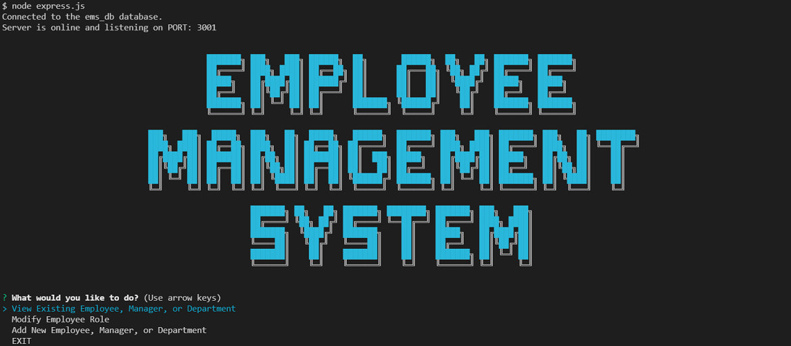

# Employee Management System

  

## Description

This app is a Node.js command-line application that allows users to manage a company's employees using node, inquirer, and MySQL.
  

## Table of Contents

- [Installation](#installation)
- [Usage](#usage)
- [License](#license)
- [Collaborators](#collaborators)
- [Questions](#questions)
  

## Installation

This repository can be cloned by using the following command:
~~~
gh repo clone rmoatman/Employee_Management_System
~~~

Then, install the inquirer, MySql, console.table, and cfonts dependencies using the command:
~~~
npm install
~~~
 

## Usage

To run the app, use the command:
~~~
node express.js
~~~
A demonstration video can be found here: https://drive.google.com/file/d/1eE2V3tOC90V7doQAnruUemwi7jHwMKrx/view
  
## License

This work is covered under MIT License.  For more information, click on the license badge above.
  

## Collaborators

Please contact me using the information below for questions, comments, and suggestions.
  

## Questions

Have a question or comment?  Please contact me at: 
Raemarie Oatman 
GitHub Profile: github.com/rmoatman 
raemarie.oatman@gmail.com 

